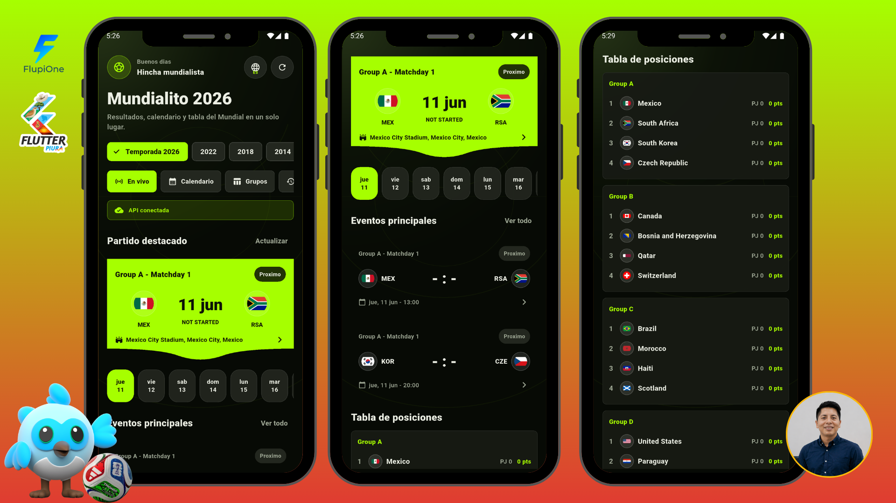
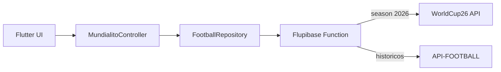

# Mundialito

Mundialito es una app Flutter bilingue, en espanol e ingles, para seguir el
Mundial con calendario, resultados, partidos en vivo, grupos, detalle de
partidos e historicos. El foco operativo por defecto es el Mundial 2026.

La app esta disenada con una arquitectura feature-first, consumo de datos reales
via Flupibase Functions, cache en memoria por temporada y refresco silencioso
para una experiencia en vivo sin parpadeos de carga.

## Vista previa

La portada del producto esta versionada en [`assets/portada.png`](assets/portada.png).

<p align="center">
  
</p>

## Principios

- Datos reales solamente: la app no incluye data mockeada ni inventa partidos.
- API keys fuera del cliente: el cliente Flutter invoca Flupibase Functions.
- UX estable: cambio de tabs, fechas y temporadas sin limpiar la pantalla.
- Tiempo real pragmativo: polling silencioso cada 30 segundos y cache del proxy
  de 15 segundos.
- Arquitectura mantenible: presentacion delgada, dominio explicito,
  repositorio de datos y mapper aislado.
- Sin registro: la app esta orientada a consulta publica de informacion.

## Arquitectura



### Capas principales

- `app/`: composicion de dependencias, scope global y arranque de la app.
- `core/`: configuracion, cliente HTTP, localizacion, tema y utilidades.
- `features/mundial/domain/`: modelos de negocio de partidos, equipos,
  standings y eventos.
- `features/mundial/data/`: service, repository y mapper de APIs externas.
- `features/mundial/presentation/`: controller, paginas y widgets.
- `functions/`: Flupibase Function que normaliza proveedores externos.

## Datos

Para `season=2026`, la function usa WorldCup26 por defecto:

- Documentacion: https://worldcup26.ir/api-docs/
- Recursos usados: juegos, equipos, grupos y estadios.
- No requiere API key.

Para temporadas historicas, la function puede usar API-FOOTBALL si existe el
secret `API_FOOTBALL_KEY` en Flupibase.

Nota importante: WorldCup26 expone calendario, equipos, grupos, estadios y
marcadores. Si un proveedor no entrega eventos minuto a minuto para un partido,
la app no los inventa; solo muestra eventos derivados cuando la fuente trae
minuto en el dato.

## Stack

- Flutter Material 3.
- `ChangeNotifier` + `InheritedNotifier` para estado de app sin dependencia
  pesada.
- [Flupibase](https://flupibase.com) Functions como backend proxy.
- WorldCup26 API para Mundial 2026.
- API-FOOTBALL como fallback para historicos.
- Configuracion local desde `config/.env` con prioridad secundaria a
  `--dart-define`.

Mundialito tambien funciona como ejemplo practico para probar
[Flupibase](https://flupibase.com), un backend moderno para exponer functions,
proteger secrets y conectar apps Flutter con APIs externas sin filtrar claves en
el cliente.

## Configuracion

### 1. Dependencias Flutter

```bash
flutter pub get
```

### 2. Dependencias de la function

```bash
npm.cmd --prefix functions install
```

### 3. Login en Flupibase

```bash
npm.cmd --prefix functions run login
```

### 4. Secret para historicos

Solo es necesario si vas a consumir temporadas historicas via API-FOOTBALL.

```bash
npm.cmd --prefix functions run secrets:set -- API_FOOTBALL_KEY --value TU_API_KEY
```

### 5. Configuracion de proyecto

Revisa `functions/flupibase.json` si tu proyecto no se llama
`mundialito-app`.

### 6. Deploy

```bash
npm.cmd --prefix functions run deploy
```

### 7. Ejecucion local con F5

Crea o edita `config/.env`:

```env
FLUPIBASE_BASE_URL=https://flupibase.com/api/v1
FLUPIBASE_PROJECT_ID=mundialito-app
FLUPIBASE_API_KEY=TU_FLUPIBASE_PROJECT_API_KEY
FLUPIBASE_FUNCTION_NAME=mundialito-football
```

`config/.env` se carga como asset al iniciar la app. Si cambias ese archivo,
deten la app y vuelve a lanzarla con F5 para que Flutter vuelva a empaquetar el
asset.

No pongas `API_FOOTBALL_KEY` en `config/.env`; esa key pertenece solo a
Flupibase Functions secrets.

Tambien puedes usar `--dart-define`, que tiene prioridad sobre `config/.env`:

```bash
flutter run --dart-define=FLUPIBASE_BASE_URL=https://flupibase.com/api/v1 --dart-define=FLUPIBASE_PROJECT_ID=mundialito-app --dart-define=FLUPIBASE_API_KEY=TU_FLUPIBASE_PROJECT_API_KEY --dart-define=FLUPIBASE_FUNCTION_NAME=mundialito-football
```

## Recursos soportados por la function

- `fixtures`: calendario por temporada.
- `live`: partidos en vivo.
- `fixture`: detalle de un partido por fixture id.
- `events`: eventos de un partido cuando el proveedor los entrega.
- `standings`: tabla de grupos.
- `teams`: equipos.
- `rounds`: rondas/fases.
- `stadiums`: estadios de 2026.

## Estructura

```text
assets/
  details.png
  grupos.png
  home.png
  portada.png
  proximos.png
config/
  .env.example
functions/
  index.js
  flupibase.json
  package.json
lib/
  app/
  core/
    config/
    localization/
    network/
    theme/
    utils/
  features/
    mundial/
      data/
      domain/
      presentation/
```

## Validacion

Por decision del propietario del proyecto, en esta implementacion no se
ejecuto:

- `flutter pub get`
- `flutter analyze`
- tests
- formatters
- `npm install`
- despliegue de functions

Validaciones realizadas en el backend JS:

- `node --check functions/index.js`

## Licencia

Este proyecto usa licencia MIT. Puedes verla aqui: [LICENCE](LICENCE).

## Autor

Gian Sandoval, Software Architect.

- GitHub: [GianSandoval5](https://github.com/GianSandoval5)
- LinkedIn: [giansandoval](https://www.linkedin.com/in/giansandoval/)
